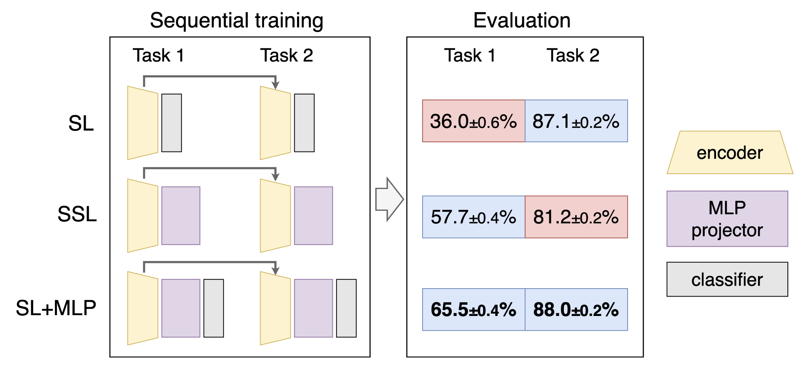

# Revisiting Supervision for Continual Representation Learning

This is the official repository for the paper:

> **[Revisiting Supervision for Continual Representation Learning](https://arxiv.org/abs/2311.13321)**<br>
> [Daniel Marczak](https://scholar.google.com/citations?user=Vs4kBzQAAAAJ&hl=en), [Sebastian Cygert](https://scholar.google.com/citations?hl=en&user=wLH9PP8AAAAJ), [Tomasz Trzciński](https://scholar.google.com/citations?hl=en&user=bJMRBFoAAAAJ), [Bartłomiej Twardowski](https://scholar.google.com/citations?hl=en&user=8yywECgAAAAJ)<br>
> ECCV 2024

**TL;DR**: Supervised learning with simple modifications can outperform self-supervised learning in continual representation learning.

<p align="center">

</p>

> **Abstract:** In the field of continual learning, models are designed to learn tasks one after the other. While most research has centered on supervised continual learning, there is a growing interest in unsupervised continual learning, which makes use of the vast amounts of unlabeled data. Recent studies have highlighted the strengths of unsupervised methods, particularly self-supervised learning, in providing robust representations. The improved transferability of those representations built with self-supervised methods is often associated with the role played by the multi-layer perceptron projector. In this work, we depart from this observation and reexamine the role of supervision in continual representation learning. We reckon that additional information, such as human annotations, should not deteriorate the quality of representations. Our findings show that supervised models when enhanced with a multi-layer perceptron head, can outperform self-supervised models in continual representation learning. This highlights the importance of the multi-layer perceptron projector in shaping feature transferability across a sequence of tasks in continual learning.

## Installation
Use the following commands to create an environment and install the required packages (needs `conda`):
```
conda create --name cassle python=3.8
conda activate cassle
pip3 install torch torchvision torchaudio --index-url https://download.pytorch.org/whl/cu118
pip install pytorch-lightning lightning-bolts wandb scikit-learn einops
pip install --extra-index-url https://developer.download.nvidia.com/compute/redist --upgrade nvidia-dali-cuda110
```
Remember to check your cuda version and modify the install commands accorgingly.


## Datasets
Most of the datasets (CIFAR10, CIFAR100, SVHN, transfer datasets) are automatically downloaded by `torchvision.datasets` module. ImageNet100 is a subset of [ImageNet dataset](https://www.image-net.org/index.php) containing 100 classes defined [here](https://github.com/HobbitLong/CMC/blob/master/imagenet100.txt).

## Reproducibility

### Main results
To reproduce main results from Table 1, Table 2, Figure 2 and Figure 3 run:
```bash
bash run_main_results.bash
```

### Transfer results
To reproduce main results from Table 3 and Figure 4:
* insert checkpoints ids into `main_eval_transfer_knn.py` script
* run it with `python main_eval_transfer_knn.py`

### Two-task experiments
To reproduce two-task results from Figure 1, Table 4, Table 5 and Figure 5 run:
```bash
bash run_2_task_exps.bash
```

### Stability of representations
To reproduce results of Figure 2 (Appendix):
* insert checkpoints paths into `nmc-classifier.py` script
* run it with `python nmc-classifier.py`


## Logging
Logging is performed with [WandB](https://wandb.ai/site). Please create an account and specify your `--entity YOUR_ENTITY` and `--project YOUR_PROJECT` in the bash scripts. For debugging, or if you do not want all the perks of WandB, you can disable logging by passing `--offline` in your bash scripts. After training you can always sync an offline run with the following command: `wandb sync your/wandb/run/folder`.

## Credits

Repo is based on [cassle](https://github.com/DonkeyShot21/cassle)

## Citation
If you find this work useful, please consider citing it:
```bibtex
@article{marczak2023revisiting,
    title   = {Revisiting Supervision for Continual Representation Learning},
    author  = {Daniel Marczak and Sebastian Cygert and Tomasz Trzciński and Bartłomiej Twardowski},
    booktitle = {European Conference on Computer Vision (ECCV)},
    year    = {2024}
}
```
